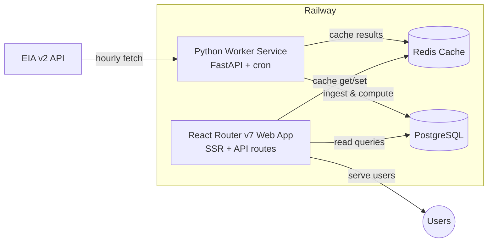

# GRID-008: GridPulse MVP Architecture Design

**Status**: ✅ Design Complete  
**Priority**: High  
**Created**: 2025-08-22  
**Updated**: 2025-08-22  

**Issue Link**: https://github.com/awynne/grid/issues/15

## Overview

Define the technical architecture for GridPulse MVP, including service design, data storage, caching strategy, and background job processing.

## Problem Statement

GridPulse requires a fundamentally different architecture than a typical CRUD project management application:
- High-volume time-series data ingestion 
- Background data processing and computation
- Public-first access pattern
- Real-time freshness indicators
- Complex analytical queries

Need to design an architecture that starts simple (MVP) but can scale to production requirements.

## Scope

### In Scope
- Service architecture (monolithic vs microservices)
- Database design and storage strategy
- Caching layer implementation
- Background job processing
- Authentication simplification
- Development and deployment patterns

### Out of Scope
- Specific UI/UX design (covered in product docs)
- Detailed database schema (depends on GRID-007 findings)
- Infrastructure scaling beyond MVP
- Third-party integrations beyond EIA API

## Architecture Decisions

### Service Architecture: Dual-Service Pattern

**Decision**: Split into two services instead of monolithic React Router v7 app



**Rationale**:
- **Separation of concerns**: Web service focuses on fast responses, worker handles heavy lifting
- **Independent scaling**: Can scale services based on different needs
- **Reliability**: EIA API issues don't block user interface
- **Simplicity**: Avoids complexity of full microservices

### Database: TimescaleDB with Hypertables

**Decision**: Start with TimescaleDB for time-series optimization from day 1

```sql
-- Core schema structure
CREATE TABLE balancing_authorities (
  id UUID PRIMARY KEY DEFAULT gen_random_uuid(),
  code VARCHAR(10) UNIQUE NOT NULL, -- "PJM", "CAISO"
  name VARCHAR(255) NOT NULL,
  timezone VARCHAR(50) NOT NULL,
  created_at TIMESTAMPTZ DEFAULT NOW()
);

CREATE TABLE series (
  id UUID PRIMARY KEY DEFAULT gen_random_uuid(),
  ba_id UUID REFERENCES balancing_authorities(id),
  type VARCHAR(50) NOT NULL, -- "demand", "fuel_mix", "co2"
  units VARCHAR(20), -- "MW", "g/kWh"
  last_observed_at TIMESTAMPTZ,
  UNIQUE(ba_id, type)
);

-- TimescaleDB hypertable for time-series data
CREATE TABLE observations (
  series_id UUID REFERENCES series(id),
  ts TIMESTAMPTZ NOT NULL,
  value NUMERIC NOT NULL,
  PRIMARY KEY (series_id, ts)
);

-- Convert to hypertable (automatic partitioning)
SELECT create_hypertable('observations', 'ts');

-- Add continuous aggregates for dashboard performance
CREATE MATERIALIZED VIEW hourly_demand_summary
WITH (timescaledb.continuous) AS
SELECT time_bucket('1 hour', ts) as hour,
       series_id,
       avg(value) as avg_value,
       max(value) as max_value
FROM observations
GROUP BY hour, series_id;
```

**Rationale** (based on GRID-007 analysis):
- **Negligible additional effort**: Only +0.5 hours over PostgreSQL setup
- **Same PostgreSQL foundation**: No learning curve, still uses PostgreSQL/Prisma
- **Future-proofed**: No migration needed later, optimized for time-series from day 1
- **Better performance**: Automatic partitioning and continuous aggregates
- **Minimal storage costs**: <$0.01/month for MVP (13 MB storage)
- **Cost effective**: Storage costs negligible even at production scale ($0.17/month)

### Caching: Redis for Computed Results

**Decision**: Use Redis (Upstash on Railway) for caching expensive computations

```typescript
// Cache patterns
const cacheKeys = {
  baList: 'ba:list:v1',
  dailyPulse: (ba: string, date: string) => `daily:${ba}:${date}`,
  cleanWindow: (ba: string) => `clean:${ba}:${Date.now().toString().slice(0, -5)}`, // 10min TTL
  freshness: (ba: string) => `freshness:${ba}:v1`,
  duckScores: (ba: string, days: number) => `ducks:${ba}:${days}d`,
};
```

**Rationale**:
- **Performance**: Pre-computed results serve instantly
- **Reliability**: Can serve stale data if EIA API is down
- **Cost efficiency**: Reduces database query load
- **Simple patterns**: Easy to implement and debug

### Background Jobs: Python with APScheduler

**Decision**: Use Python with APScheduler for scheduled ingestion and data processing

```python
# Python cron patterns for data processing
from apscheduler.schedulers.asyncio import AsyncIOScheduler
import pandas as pd

scheduler = AsyncIOScheduler()

# Every hour at 15 minutes past (gives EIA time to publish)
@scheduler.scheduled_job('cron', minute=15)
async def ingest_latest_data():
    await ingest_eia_data()

# Daily computation at 1 AM
@scheduler.scheduled_job('cron', hour=1)
async def compute_daily_metrics():
    await compute_dashboard_metrics()
```

**Rationale**:
- **Data processing power**: Native pandas/numpy for efficient time-series operations
- **Scientific libraries**: Access to scipy, statsmodels for advanced analytics
- **Reliability**: APScheduler provides robust error handling and retries
- **Future-proof**: No migration needed for ML/analytics features

### Authentication: Public-First with Optional Preferences

**Decision**: Simplify auth to anonymous preference cookies + optional OAuth

```typescript
// Anonymous preferences (no login required)
interface AnonymousPrefs {
  defaultBA: string;
  timezone: string;
  theme: 'light' | 'dark' | 'system';
}

// Optional authenticated features
interface AuthenticatedFeatures {
  savedViews: SavedView[];
  alertPreferences: AlertPrefs[];
  embeddedDashboards: Dashboard[];
}
```

**Rationale**:
- **Lower barrier**: Users can explore immediately without signup
- **Focused scope**: Removes team collaboration complexity
- **Progressive enhancement**: Auth adds value without being required

## Implementation Plan

### Phase 1: Foundation (GRID-011/012) - Infrastructure Setup
- [x] Set up web service structure in Railway (GRID-011)
- [ ] Implement TimescaleDB schema with hypertables (GRID-012)
- [ ] Configure continuous aggregates for dashboard queries (GRID-012)
- [ ] Add Redis caching layer (GRID-014)

### Phase 2: Data Processing (GRID-013) - Python Worker Service  
- [ ] Create Python FastAPI worker service
- [ ] Implement EIA API ingestion with pandas (18.8 records/hour/BA)
- [ ] Add APScheduler for reliable job processing
- [ ] Implement Daily Pulse computation and caching
- [ ] Create duck curve scoring with scientific libraries
- [ ] Add CO2 analysis with statsmodels

### Phase 3: UI Integration (GRID-015) - Full Stack Integration
- [ ] Complete REST API implementation
- [ ] Connect React Router v7 frontend to cached data
- [ ] Implement freshness indicators  
- [ ] Add anonymous preference system
- [ ] Create embeddable components
- [ ] Enable advanced analytics features

## Design Acceptance Criteria

- [x] **Service architecture defined**: Dual-service pattern with clear separation of concerns
- [x] **Database strategy decided**: TimescaleDB with hypertables based on GRID-007 analysis
- [x] **Caching strategy specified**: Redis patterns for performance optimization
- [x] **Background job processing designed**: node-cron for MVP, BullMQ upgrade path
- [x] **Authentication approach defined**: Public-first with optional OAuth
- [x] **Migration strategy planned**: Python/FastAPI long-term evolution path
- [x] **Database schema designed**: Core tables and hypertable structure
- [x] **API patterns specified**: Cache keys and REST API patterns
- [x] **Cost targets established**: $25/month Railway budget with projections
- [x] **Performance targets set**: Query times, ingestion rates, storage growth
- [x] **Research dependencies resolved**: GRID-007 and Python migration analysis complete

## Implementation Success Metrics

*Note: These metrics apply to future implementation phases, not the design spec itself*

- [ ] Worker can ingest 24 hours of data for 5 BAs in <5 minutes (2,256 records)
- [ ] Web API responses <300ms for cached data
- [ ] Database queries <5ms for MVP scale (based on GRID-007 benchmarks)
- [ ] Storage growth matches 0.08 MB/day for 5 BAs
- [ ] System stays under $25/month on Railway for MVP scale
- [ ] TimescaleDB hypertable setup completed in <1 hour total effort

## Dependencies

- **GRID-007**: ✅ Completed - Data volume analysis confirms TimescaleDB approach
- **Python Migration Analysis**: ✅ Completed - Strategic analysis confirms hybrid migration path
- EIA API key access
- Railway services setup (web, worker, Redis, TimescaleDB)

## Future Considerations

### TimescaleDB Optimization (Future)
As data volume grows beyond MVP (based on GRID-007 findings):
- Add compression policies: `SELECT add_compression_policy('observations', INTERVAL '7 days')`
- Implement data retention: `SELECT add_retention_policy('observations', INTERVAL '5 years')`
- Optimize continuous aggregates for specific dashboard patterns
- Monitor hypertable chunk health and performance

### Queue System Upgrade
When node-cron becomes insufficient:
- Migrate to BullMQ with Redis backend
- Add job retry logic and dead letter queues
- Implement job monitoring and alerting
- Add rate limiting for EIA API calls

### Python Migration Strategy (Long-term)
Strategic migration to Python/FastAPI for advanced data processing:

#### Phase 1: MVP Foundation (Current)  
- Start directly with Python worker service (GRID-013)
- Design language-agnostic REST APIs
- Establish database-centric architecture patterns

#### Phase 2: Hybrid Architecture (6-12 months)
- Introduce Python analytics microservice alongside Node.js
- Migrate complex calculations to Python (duck curve, CO2 analysis)
- Keep simple ingestion in Node.js initially

```python
# Python Analytics Service
from fastapi import FastAPI, BackgroundTasks
from celery import Celery
import pandas as pd

app = FastAPI(title="GridPulse Analytics")
celery_app = Celery('analytics', broker='redis://localhost:6379')

@app.post("/analytics/duck-curve/{ba_code}")
async def analyze_duck_curve(ba_code: str, days: int = 30):
    task = calculate_duck_metrics.delay(ba_code, days)
    return {"task_id": task.id, "status": "processing"}

@celery_app.task
def calculate_duck_metrics(ba_code: str, days: int):
    # Complex pandas/numpy operations
    data = fetch_timeseries_data(ba_code, days)
    metrics = analyze_duck_curve_patterns(data)
    return metrics
```

#### Phase 3: Full Python Migration (12+ months)
- Complete migration to Python for all data processing
- Keep React Router v7 frontend (optimal for UI/UX)
- Enable advanced ML/AI features

**Migration Benefits:**
- **Development velocity**: 75% faster for complex analytics
- **Scientific computing**: Access to pandas, numpy, scipy ecosystem
- **Future-proofing**: Ready for ML features (demand forecasting, anomaly detection)
- **Cost impact**: Minimal increase ($10/month) for significant capability gains

**Reference**: See [Python Migration Analysis](../research/GRID-008-python-migration-analysis.md) for detailed technical comparison and implementation strategy.

## Key Research Findings Integration

### GRID-007: Data Volume Analysis
Based on comprehensive data volume analysis:

- **Storage Requirements**: MVP needs only 13 MB (0.013 GB) for 6 months of 5 BAs
- **Performance**: All queries <5ms at MVP scale, <50ms at production scale
- **Cost Impact**: Storage costs negligible (<$0.01/month MVP, $0.17/month production)
- **Implementation Effort**: TimescaleDB adds only +0.5 hours vs PostgreSQL
- **Data Volume**: 18.8 records/hour/BA average, 2,256 records/day for 5 BAs
- **Migration**: No future database migration needed - start with optimal architecture

### Python Migration Analysis
Based on strategic technology analysis:

- **Development Velocity**: 75% faster development for complex analytics in Python
- **Scientific Computing**: Access to pandas, numpy, scipy for sophisticated calculations
- **Performance**: FastAPI achieves comparable performance to Node.js
- **Cost Impact**: Minimal increase ($10/month) for significant capability gains
- **Migration Strategy**: Incremental hybrid approach preserves MVP timeline
- **Future Capabilities**: Enables ML/AI features (forecasting, anomaly detection)

**Reference**: See [Python Migration Analysis](../research/GRID-008-python-migration-analysis.md) for detailed technical comparison

## Notes

This architecture balances simplicity for rapid MVP development with clear upgrade paths for production scaling. GRID-007 analysis confirms TimescaleDB is the optimal choice from day 1 with negligible additional complexity. Each component can be enhanced independently as requirements become clearer.