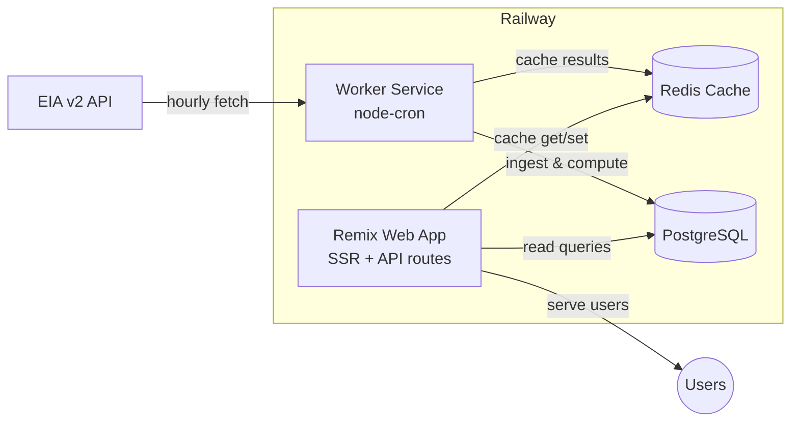

# GRID-008: GridPulse MVP Architecture Design

**Status**: 🆕 New  
**Priority**: High  
**Created**: 2025-08-22  
**Updated**: 2025-08-22  

**Issue Link**: *To be created*

## Overview

Define the technical architecture for GridPulse MVP, including service design, data storage, caching strategy, and background job processing.

## Problem Statement

GridPulse requires a fundamentally different architecture than a typical CRUD project management application:
- High-volume time-series data ingestion 
- Background data processing and computation
- Public-first access pattern
- Real-time freshness indicators
- Complex analytical queries

Need to design an architecture that starts simple (MVP) but can scale to production requirements.

## Scope

### In Scope
- Service architecture (monolithic vs microservices)
- Database design and storage strategy
- Caching layer implementation
- Background job processing
- Authentication simplification
- Development and deployment patterns

### Out of Scope
- Specific UI/UX design (covered in product docs)
- Detailed database schema (depends on GRID-007 findings)
- Infrastructure scaling beyond MVP
- Third-party integrations beyond EIA API

## Architecture Decisions

### Service Architecture: Dual-Service Pattern

**Decision**: Split into two services instead of monolithic Remix app



**Rationale**:
- **Separation of concerns**: Web service focuses on fast responses, worker handles heavy lifting
- **Independent scaling**: Can scale services based on different needs
- **Reliability**: EIA API issues don't block user interface
- **Simplicity**: Avoids complexity of full microservices

### Database: PostgreSQL with Manual Partitioning

**Decision**: Start with PostgreSQL, monthly partitioning on observations table

```sql
-- Core schema structure
CREATE TABLE balancing_authorities (
  id UUID PRIMARY KEY DEFAULT gen_random_uuid(),
  code VARCHAR(10) UNIQUE NOT NULL, -- "PJM", "CAISO"
  name VARCHAR(255) NOT NULL,
  timezone VARCHAR(50) NOT NULL,
  created_at TIMESTAMPTZ DEFAULT NOW()
);

CREATE TABLE series (
  id UUID PRIMARY KEY DEFAULT gen_random_uuid(),
  ba_id UUID REFERENCES balancing_authorities(id),
  type VARCHAR(50) NOT NULL, -- "demand", "fuel_mix", "co2"
  units VARCHAR(20), -- "MW", "g/kWh"
  last_observed_at TIMESTAMPTZ,
  UNIQUE(ba_id, type)
);

-- Partitioned time-series table
CREATE TABLE observations (
  series_id UUID REFERENCES series(id),
  ts TIMESTAMPTZ NOT NULL,
  value NUMERIC NOT NULL,
  PRIMARY KEY (series_id, ts)
) PARTITION BY RANGE (ts);

-- Monthly partitions (created automatically by migration)
CREATE TABLE observations_2025_08 PARTITION OF observations
  FOR VALUES FROM ('2025-08-01') TO ('2025-09-01');
```

**Rationale**:
- **Familiar technology**: Team already knows PostgreSQL/Prisma
- **Good enough for MVP**: Can handle months of data efficiently
- **Migration path**: Easy to upgrade to TimescaleDB later based on GRID-007 findings
- **Cost effective**: No additional specialized database costs

### Caching: Redis for Computed Results

**Decision**: Use Redis (Upstash on Railway) for caching expensive computations

```typescript
// Cache patterns
const cacheKeys = {
  baList: 'ba:list:v1',
  dailyPulse: (ba: string, date: string) => `daily:${ba}:${date}`,
  cleanWindow: (ba: string) => `clean:${ba}:${Date.now().toString().slice(0, -5)}`, // 10min TTL
  freshness: (ba: string) => `freshness:${ba}:v1`,
  duckScores: (ba: string, days: number) => `ducks:${ba}:${days}d`,
};
```

**Rationale**:
- **Performance**: Pre-computed results serve instantly
- **Reliability**: Can serve stale data if EIA API is down
- **Cost efficiency**: Reduces database query load
- **Simple patterns**: Easy to implement and debug

### Background Jobs: node-cron for MVP

**Decision**: Use node-cron for scheduled ingestion, upgrade to BullMQ later if needed

```typescript
// Simple cron patterns for MVP
import cron from 'node-cron';

// Every hour at 15 minutes past (gives EIA time to publish)
cron.schedule('15 * * * *', async () => {
  await ingestLatestData();
});

// Daily computation at 1 AM
cron.schedule('0 1 * * *', async () => {
  await computeDailyMetrics();
});
```

**Rationale**:
- **Simplicity**: Minimal setup and configuration
- **Reliability**: Good enough for hourly ingestion
- **Upgrade path**: Can migrate to BullMQ when we need better error handling and retries

### Authentication: Public-First with Optional Preferences

**Decision**: Simplify auth to anonymous preference cookies + optional OAuth

```typescript
// Anonymous preferences (no login required)
interface AnonymousPrefs {
  defaultBA: string;
  timezone: string;
  theme: 'light' | 'dark' | 'system';
}

// Optional authenticated features
interface AuthenticatedFeatures {
  savedViews: SavedView[];
  alertPreferences: AlertPrefs[];
  embeddedDashboards: Dashboard[];
}
```

**Rationale**:
- **Lower barrier**: Users can explore immediately without signup
- **Focused scope**: Removes team collaboration complexity
- **Progressive enhancement**: Auth adds value without being required

## Implementation Plan

### Phase 1: Foundation (GRID-008)
- [ ] Set up dual-service structure in Railway
- [ ] Implement basic PostgreSQL schema with partitioning
- [ ] Add Redis caching layer
- [ ] Create basic EIA API ingestion job

### Phase 2: Core Features (GRID-009)
- [ ] Implement Daily Pulse computation and caching
- [ ] Add What's Powering Me CO2 analysis
- [ ] Build duck curve scoring algorithm
- [ ] Create diff/baseline calculations

### Phase 3: UI Integration (GRID-010)
- [ ] Connect Remix frontend to cached data
- [ ] Implement freshness indicators
- [ ] Add anonymous preference system
- [ ] Create embeddable components

## Success Metrics

- [ ] Worker can ingest 24 hours of data for 5 BAs in <5 minutes
- [ ] Web API responses <300ms for cached data
- [ ] Database can handle 1 month of observations without performance degradation
- [ ] System stays under $50/month on Railway for MVP scale

## Dependencies

- **GRID-007**: Data volume analysis informs partition strategy
- EIA API key access
- Railway services setup (web, worker, Redis, PostgreSQL)

## Future Considerations

### Migration to TimescaleDB
When PostgreSQL becomes insufficient (based on GRID-007 findings):
- TimescaleDB Cloud addon on Railway
- Migrate schema to use hypertables
- Add compression policies
- Implement continuous aggregates

### Queue System Upgrade
When node-cron becomes insufficient:
- Migrate to BullMQ with Redis backend
- Add job retry logic and dead letter queues
- Implement job monitoring and alerting
- Add rate limiting for EIA API calls

## Notes

This architecture balances simplicity for rapid MVP development with clear upgrade paths for production scaling. Each component can be enhanced independently as requirements become clearer.