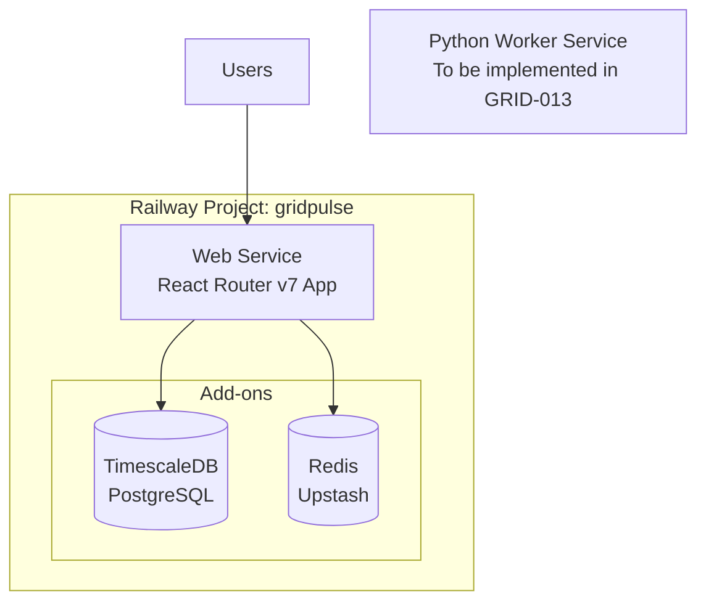

# GRID-011: Railway Infrastructure Setup

**Status**: 🔄 In Progress  
**Priority**: High  
**Created**: 2025-08-22  
**Updated**: 2025-08-25  

**Issue Link**: https://github.com/awynne/grid/issues/22

## Overview

Set up the dual-service Railway infrastructure for GridPulse MVP, including web service, worker service, and required add-ons (TimescaleDB, Redis).

## Problem Statement

GridPulse requires a dual-service architecture on Railway with:
- Web service for React Router v7 SSR + API routes
- Worker service for Node.js data ingestion
- TimescaleDB for time-series data storage
- Redis for caching layer
- Cost optimization to stay under $25/month budget

## Scope

### In Scope
- Railway project setup and configuration
- Web service deployment configuration
- Worker service deployment configuration  
- TimescaleDB add-on setup
- Redis (Upstash) add-on setup
- Environment variable management
- Service networking and communication
- Cost monitoring and optimization

### Out of Scope
- Application code implementation (covered in other specs)
- Database schema creation (GRID-012)
- Data ingestion logic (GRID-013)
- Caching implementation (GRID-014)

## Technical Requirements

### Railway Services Architecture



### Service Specifications

#### Web Service Configuration
```yaml
# railway.json for web service
{
  "build": {
    "builder": "NIXPACKS"
  },
  "deploy": {
    "startCommand": "npm start",
    "healthcheckPath": "/health",
    "healthcheckTimeout": 30
  }
}
```

**Resource Requirements:**
- **Memory**: 512MB (can scale to 1GB if needed)
- **CPU**: 0.5 vCPU shared
- **Expected cost**: ~$10-12/month

#### Worker Service Configuration
```yaml
# railway.json for worker service  
{
  "build": {
    "builder": "NIXPACKS"
  },
  "deploy": {
    "startCommand": "node dist/worker.js",
    "healthcheckPath": "/worker/health",
    "healthcheckTimeout": 30
  }
}
```

**Resource Requirements:**
- **Memory**: 256MB (lightweight for cron jobs)
- **CPU**: 0.25 vCPU shared
- **Expected cost**: ~$5-8/month

### Add-on Configuration

#### TimescaleDB Setup
- **Service**: Railway PostgreSQL with TimescaleDB extension
- **Plan**: Hobby plan (1GB RAM, 1GB storage initially)
- **Expected cost**: ~$5/month
- **Configuration**:
  ```sql
  -- Enable TimescaleDB extension
  CREATE EXTENSION IF NOT EXISTS timescaledb;
  ```

#### Redis Setup  
- **Service**: Upstash Redis add-on
- **Plan**: Free tier initially (10K requests/day)
- **Expected cost**: $0/month (free tier)
- **Upgrade trigger**: >8K requests/day sustained

### Environment Variables

#### Shared Variables
```bash
# Database
DATABASE_URL=postgresql://...
POSTGRES_URL=postgresql://...  # Railway format

# Redis
REDIS_URL=redis://...
UPSTASH_REDIS_REST_URL=https://...
UPSTASH_REDIS_REST_TOKEN=...

# Application
NODE_ENV=production
```

#### Web Service Specific
```bash
# React Router v7
SESSION_SECRET=...
PORT=3000

# API Keys (read-only for web service)
EIA_API_KEY=...  # For API route fallbacks only
```

#### Worker Service Specific  
```bash
# EIA API
EIA_API_KEY=...  # Primary API access
EIA_BASE_URL=https://api.eia.gov/v2

# Job Configuration
CRON_ENABLED=true
INGEST_SCHEDULE="15 * * * *"  # Every hour at 15 minutes past
```

## Implementation Tasks

### Phase 1: Codebase Preparation ✅ COMPLETED
- [x] Create health check endpoints for both services
- [x] Implement worker service with Express server
- [x] Configure TypeScript build pipeline for worker
- [x] Create Railway configuration files
- [x] Update package.json with worker scripts and dependencies

### Phase 2: Manual Railway Setup (IN PROGRESS)
**See [docs/railway-setup-guide.md](../railway-setup-guide.md) for detailed instructions**

#### Test Environment:
- [ ] Create web-test service from GitHub repo
- [ ] Create worker-test service from GitHub repo  
- [ ] Add postgres-test database with TimescaleDB extension
- [ ] Add redis-test cache (Upstash)
- [ ] Configure environment variables for test environment
- [ ] Verify health endpoints respond correctly

#### Production Environment:
- [ ] Create web-prod service from GitHub repo
- [ ] Create worker-prod service from GitHub repo
- [ ] Add postgres-prod database with TimescaleDB extension  
- [ ] Add redis-prod cache (Upstash)
- [ ] Configure environment variables for production environment
- [ ] Verify health endpoints respond correctly

### Phase 3: Service Integration
- [ ] Test database connectivity from both services
- [ ] Test Redis connectivity from both services
- [ ] Configure logging and monitoring
- [ ] Set up cost monitoring and alerts
- [ ] Validate cost projections under $25/month

## Success Criteria

### Functional Requirements
- [x] Web services deploy successfully (test: auto, prod: manual)
- [x] Web services respond to HTTP requests  
- [x] Database connections established from web services
- [x] Redis connections established from web services
- [x] Health checks pass for web services
- [ ] Worker service implementation (deferred to GRID-013 Python implementation)

### Performance Requirements
- [ ] Web service startup time <30 seconds
- [ ] Worker service startup time <15 seconds
- [ ] Database connection latency <50ms
- [ ] Redis connection latency <10ms

### Cost Requirements
- [ ] Total monthly cost <$25/month
- [ ] Cost monitoring alerts configured
- [ ] Resource usage tracking enabled

### Operational Requirements
- [x] Test environment auto-deployment from main branch configured
- [x] Production environment manual deployment only (no auto-deploy)
- [x] Environment variables securely managed via Railway
- [x] Health monitoring via `/health` endpoints
- [ ] Logging aggregation working
- [ ] Monitoring dashboards accessible

## Dependencies

- **GRID-008**: ✅ Architecture design complete
- GitHub repository with basic project structure
- Railway account with payment method configured
- EIA API key obtained

## Risks and Mitigations

### High Risk
- **Cost overrun**: Monitor usage closely, set up alerts
  - *Mitigation*: Start with minimal resources, scale as needed
- **Service startup failures**: Test configurations thoroughly
  - *Mitigation*: Implement comprehensive health checks

### Medium Risk  
- **Add-on connectivity issues**: Network configuration complexity
  - *Mitigation*: Use Railway's internal networking, test connections
- **Environment variable management**: Secrets exposure risk
  - *Mitigation*: Use Railway's secure environment variable system

## Future Considerations

### Scaling Triggers
- Web service: >80% CPU usage sustained for 5 minutes
- Worker service: Job execution time >5 minutes consistently
- Database: >80% storage or connection limit reached
- Redis: Approaching free tier limits

### Monitoring Setup
- Railway metrics dashboard
- Cost tracking and alerts
- Service health monitoring
- Database performance monitoring

## Service Naming Convention

**Railway Project:** `gridpulse`  
**Project URL:** https://railway.com/project/10593acb-4a7a-4331-a993-52d24860d1fa

### Test Environment Services
- `web-test` - React Router v7 web application service 
- `postgres-test` - PostgreSQL database with TimescaleDB extension
- `redis-test` - Redis cache database

### Production Environment Services  
- `web-prod` - React Router v7 web application service
- `postgres-prod` - PostgreSQL database with TimescaleDB extension  
- `redis-prod` - Redis cache database

### Naming Rationale
- **Environment suffix required** - Railway requires unique service names across entire project
- **Consistent pattern** - All services follow `{service-name}-{environment}` format
- **Clear identification** - Easy to distinguish between test and production resources
- **Configuration alignment** - Environment variables and deployment configs can reference services clearly

## Implementation Notes

### Current Status (2025-08-25)
**Phase 1 Complete:** Web service infrastructure implemented and deployed:
- Health endpoint functional at `/health` 
- Web service builds and runs successfully on Railway
- Database and Redis connections configured
- Railway MCP server used to automate most setup steps

**Worker Service Decision (2025-08-25):** Removed Node.js worker service from scope. Future worker implementation (GRID-013) will use Python instead for better data processing capabilities.

**Infrastructure Status:** 
- ✅ Web services (test/prod) deployed and healthy
- ✅ PostgreSQL with TimescaleDB extension configured  
- ✅ Redis caching layer configured
- ✅ Environment variables set via Railway MCP
- ✅ Deployment strategy configured (test: auto, prod: manual)
- ❌ Worker services removed from architecture

**Deployment Configuration:**
- **Test Environment**: Auto-deploy enabled on `main` branch pushes
- **Production Environment**: Manual deploy only via `railway deploy --environment prod`
- **Health Endpoints**: Both environments accessible and responding correctly

### Technical Notes
- This spec focuses purely on infrastructure setup and service deployment
- Application logic, database schema, and business functionality are covered in subsequent specs (GRID-012 through GRID-015)
- The dual-service architecture provides clear separation of concerns while maintaining cost efficiency within the $25/month budget constraint
- Health endpoints are simplified initially - database connection testing will be enhanced in GRID-012
